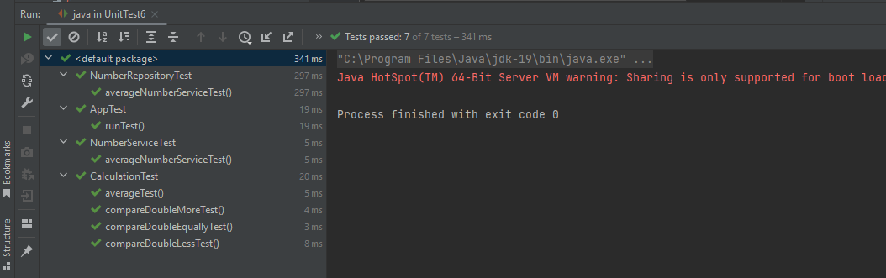
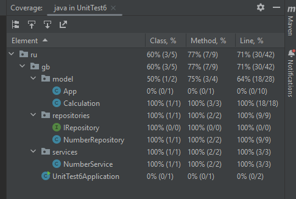

### Задание 1. Создайте программу на Python или Java, которая принимает два списка чисел и выполняет следующие действия:
- Рассчитывает среднее значение каждого списка.
- Сравнивает эти средние значения и выводит соответствующее сообщение:
- Первый список имеет большее среднее значение, если среднее значение первого списка больше.
- Второй список имеет большее среднее значение, если среднее значение второго списка больше.
- Средние значения равны, если средние значения списков равны.

### Важно:
* Приложение должно быть написано в соответствии с принципами объектно-ориентированного программирования.
* Используйте Pytest (для Python) или JUnit (для Java) для написания тестов, которые проверяют правильность работы программы.
* Тесты должны учитывать различные сценарии использования вашего приложения.
* Используйте pylint (для Python) или Checkstyle (для Java) для проверки качества кода.
* Сгенерируйте отчет о покрытии кода тестами. Ваша цель - достичь минимум 90% покрытия.

### Результат:
* Тесты создал на модель Calculation,
    * в которых тестировал методы используя unit-тесты
* Отдельно протестировал класс сервиса и репозитория
    * в них использовал mock заглушку для репозитория и сервиса
    * поскольку в этом случае есть зависимости от других частей приложения
* Также протестировал класс App, который включает работу всех частей приложения,
    * в нем использовал принцип сквозного сценария

* Codepage 
  * покрыл большую часть классов
  * класс App тоже тестировал, но в codepage он почему-то не видит

  
* Checkstyle пока не успеваю исследовать